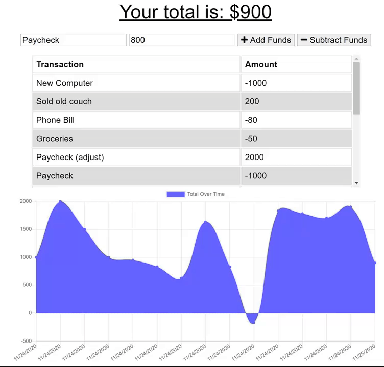
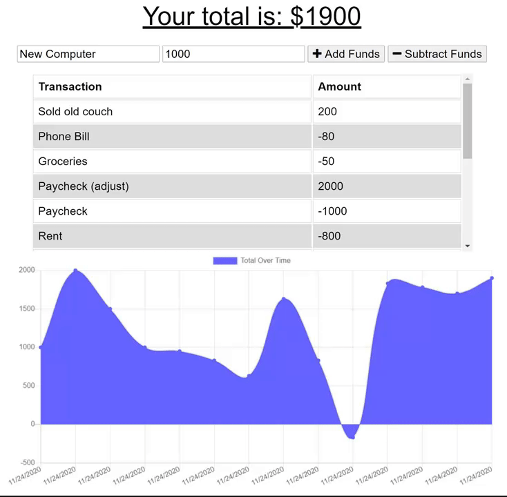
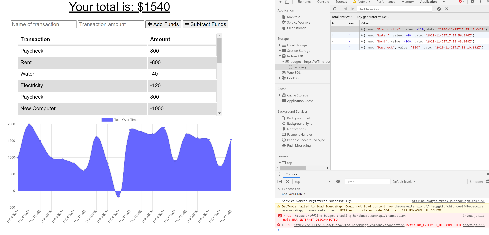
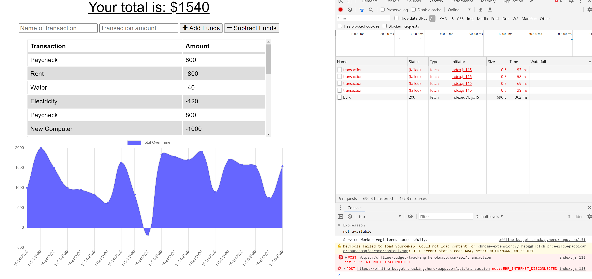

# MyBudget

## Deployed
* [Deployed App](https://offline-budget-tracking.herokuapp.com/)
* [Repository](https://github.com/celineross/My-Budget)

## Author

Celine Ross

## Description

This app allows a user to store budget data online or offline in a browser, and output that data into a table and a graph for optimal viewing.

Here you can see the Add/Subtract Funds functionality.

 
 

When the network is offline, you can see in the console that the data entered is still logged locally.

 
 

When the network goes back online, the offline data store is fetched by the remote database and added to the rest of the data.

## Requirements

Express, Mongoose, MongoDB, Morgan, Compression, Node.

## Installation

After setting up dependencies, perform an npm install. Enter npm install [package name] for additional packages.

## Usage

App is deployed onto heroku, click link above to access.

## License

ISC

## Contribution

Please contact me if you'd like to contribute to this project.
